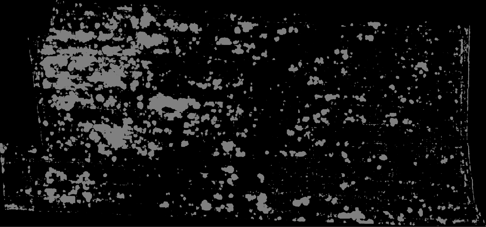
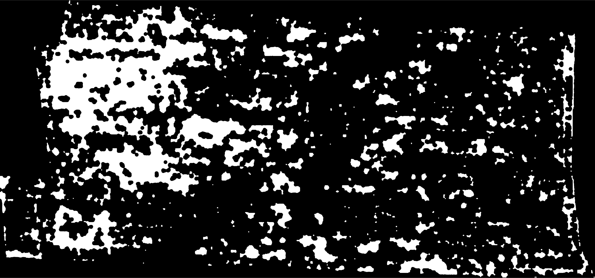

#
# Aerial Image Segmentation

This repo contains a compact pipeline to **prepare data**, **train**, and **run inference** for aerial image semantic segmentation, plus **post‑processing** and **GIS export**.

> Core idea: large GeoTIFFs are split into 256×256 tiles for training/inference; a trained U‑Net model predicts per‑pixel classes; predictions are mosaicked back, optionally morphologically cleaned, and exported as a GeoTIFF + Shapefile using the original georeference.

---

## Environment
Python 3.9.21 Conda environment with CUDA Version: 12.9

Required Python packages (from code): `tensorflow/keras`, `opencv-python`, `numpy`, `Pillow`, `patchify`, `tifffile`, `splitfolders`, `gdal` (from `osgeo`).

## Repository Layout (key files)

```
data/
    256_patches/            # intermediate patch folder before redistributing in dataset folder
    images/                 # Source GeoTIFF(s) for training or inference
    masks/                  # Ground‑truth masks (same size as images)
    predicting_images/      # Tiles created for inference (per‑case subfolder)
    predicted_masks/        # Model outputs (.png, .tif, .shp)
    models/                 # Saved Keras model(s), e.g. unet_model_multiclass_buriny.keras
    dataset/                    # dataset for training and evaluation of the models
        train/
        val/
docs/                       # notes, documents, documentation, pdfs
notebooks/                  # training pipeline jupyter notebooks
mask_postprocessing.py      # Morphological close/open on predicted masks
mask_to_geo.py              # PNG -> GeoTIFF (copy georef) -> polygonize to Shapefile
predict_mask.py             # Load model, predict per‑tile, mosaic, colorize
prepare_dataset.sh          # Legacy helper (calls old preprocessing entrypoint)
tile_image.py               # Split a single GeoTIFF into 256×256 tiles for inference
train_preprocessing.py      # Build a training dataset (patchify + filtering + split)
```

---

## Dataset Preparation (training set)

**Script:** `train_preprocessing.py`

- **Patch size:** `PATCH_SIZE = 256`.
- **Useful‑content filter:** Keeps image/mask patches where the mask has more than `USEFUL_PERC = 0.05` (5%) non‑background pixels.
- **Inputs:** expects full‑size pairs in `data/images` and `data/masks` (same shape).
- **Processing algorithm (high level):**
  1. Read each *image, mask* pair.
  2. Crop the pair so both dimensions are multiples of 256 (avoids ragged tiles).
  3. `patchify(...)` into `(256,256)` tiles for both image and mask.
  4. For each tile, compute the ratio of non‑zero mask pixels; keep if `> USEFUL_PERC`.
  5. Write kept tiles to a flat dataset folder (e.g., `dataset/images`, `dataset/masks`).
  6. Split into `train/` and `val/` sets with `splitfolders` (80/20 by default).

Result (as echoed at the end of the script):
```
dataset/
  train/
    images/ <CASE_NAME>.tif_patch_x_y.tif ...
    masks/  <CASE_NAME>.tif_patch_x_y.tif ...
  val/
    images/
    masks/
```

> Tip: if you change `PATCH_SIZE` or `USEFUL_PERC`, re‑run this script to rebuild the dataset split.

---

## Model Training

Training runs in notebooks/sreei_unet.ipynb. For detailed info open the notebook.

**Assumptions used at inference time (see `predict_mask.py`):**
- The model accepts a 256×256 color image (`H×W×3`) and returns per‑pixel **class probabilities**.
- Images are **normalized** with `keras.utils.normalize(img, axis=1)` before prediction.
- number of classes is inferred from the dataset
- Final class for each pixel is taken via `argmax` over channels.

Common choices for training (recommended):
- **Architecture:** U‑Net (2D), multi‑class softmax output.
- **Loss:** categorical cross‑entropy or Dice/CE hybrid.
- **Metrics:** mean IoU, per‑class IoU, F1/Dice.

Place your trained model file into `data/models/`.

---

## Inference on Unseen GeoTIFFs

### 1) Tile the input image

**Script:** `tile_image.py`

- Reads one GeoTIFF: `data/images/<CASE>.tif`.
- Crops the image so its height/width are multiples of 256.
- Generates a grid of tiles using `patchify(...)` and writes them to  
  `data/predicting_images/<CASE>_tiles/` as `..._patch_<i>_<j>.tif`.

**Run:**
```bash
python tile_image.py
# → ✅ N patches saved in: data/predicting_images/<CASE>_tiles
```

### 2) Predict and build the PNG from mosaic of patches

**Script:** `predict_mask.py`

- Loads model from `MODEL_PATH`.
- **Parses tile coordinates** from filename suffix `_patch_<i>_<j>.tif`.
- Reconstructs a full‑resolution mosaic by placing each predicted tile at `(i*256, j*256)`.
- **Class map:** the script uses an RGB look‑up table for a *visual* PNG:
  ```python
  #example of such color map
  COLOR_MAP = {(0,0,0): 0, (128,128,128): 1, (255,0,0): 2}  # RGB → class‑id
  ```
  Internally it builds a **LUT: class‑id → [R,G,B]** to colorize a human‑readable PNG.
- Saves the color PNG to `data/predicted_masks/<CASE>.png` and also returns the **grayscale class‑id mosaic** in memory (useful for GIS export).

**Run:**
```bash
python predict_mask.py
# → writes data/predicted_masks/<CASE>.png
```


*Figure 1. Example of predicted mask after U-Net segmentation.*

### 3) Morphological clean‑up

**Script:** `mask_postprocessing.py`

- Re‑binarizes the PNG at threshold 127 and applies:
  - **Closing** with an elliptical kernel of radius `ceil(gap_diameter_px/2)` to fill small gaps.
  - **Opening** with an elliptical kernel of size `(reach_diameter_px+1)` to remove small speckles.
- Edit the two parameters at the bottom of the file:
  ```python
  gap_diameter_px = 200   # fill gaps up to ~200 px
  reach_diameter_px = 53  # remove speckles/small branches up to ~53 px
  ```
- Saves a cleaned PNG (e.g., `Buriny_post.png`).


*Figure 2. Example of predicted & postprocessed mask after U-Net segmentation.*

**Run:**
```bash
python mask_postprocessing.py
```

### 4) Export to GeoTIFF and Shapefile

**Script:** `mask_to_geo.py`

Two steps are implemented:

1) **PNG → GeoTIFF** (`png_gray_to_geotiff`)
   - Reads the (cleaned) grayscale PNG.
   - Converts to a **binary** array: non‑zero → 1 (foreground). *(The script is currently tuned for a single foreground class; extend if needed for multi‑class GeoTIFFs.)*
   - **Copies georeference** (affine transform + projection) from a **reference** GeoTIFF of the same area.
   - Writes a single‑band GeoTIFF with `uint8` values {0,1}.

2) **GeoTIFF → Shapefile** (`geotiff_to_shapefile`)
   - Uses `gdal.Polygonize(...)` to polygonize the raster.
   - Removes polygons with `value == 0` (background), keeping only foreground shapes.
   - Writes a Shapefile with the **same CRS** as the reference raster.

**Run:**
```bash
python mask_to_geo.py
# configure:
#  png_in  = ./data/predicted_masks/Buriny_post.png
#  ref_tif = ./data/images/Buriny.tif            # GeoTIFF to copy georef/CRS from
#  tif_out = ./data/predicted_masks/Buriny_post.tif
#  shp_out = ./data/predicted_masks/Buriny_post.shp
```

> Open the Shapefile in QGIS; verify the layer CRS matches your reference and that polygons align with the source imagery. All shapefile complementary formats (.shp, .dbf, .prj, .shx) need to be included for successful validation and opening in QGIS.

---

## Evaluation (where to add)

While no dedicated evaluation script is included, typical checks are:
- **Visual sanity check** in QGIS with semi‑transparent overlay.
- **Pixel metrics** on the validation set (IoU/Dice per class).
- **Object‑level metrics**: precision/recall for connected components after post‑processing.

You can add these as a notebook in `notebooks/` and reuse the dataset split produced by `train_preprocessing.py`.

---

## Quickstart - End‑to‑End Inference

```bash
# 1) Put your GeoTIFF into: data/images/<CASE>.tif
# 2) Tile it
python tile_image.py

# 3) Run prediction (requires trained Keras model at data/models/...)
python predict_mask.py

# 4) Morphological cleanup
python mask_postprocessing.py

# 5) Export PNG → GeoTIFF → Shapefile
python mask_to_geo.py
```

---

## Notes & Gotchas

- Ensure GDAL is correctly installed (with Python bindings). On many systems you must install the system package (e.g., `gdal-bin`, `libgdal-dev`) **before** `pip install GDAL`.
- `predict_mask.py` expects tiles named `*_patch_<i>_<j>.tif`. If you change naming, also adjust the index parsing.
- `mask_to_geo.py` currently **binarizes** the mask; if you have *multi‑class* outputs, extend it to write multi‑band GeoTIFF or keep class IDs directly (skip the binarization step).
- If the reconstructed mosaic dimensions are off by one tile, check the cropping logic in `tile_image.py` (both width and height are cropped to multiples of `PATCH_SIZE`).

---

## Credits / License

- Built around a U‑Net segmentation workflow with Keras/TensorFlow and GDAL for GIS export.
- Please set your project license here and any dataset licenses/attributions.
 unet_land_s

